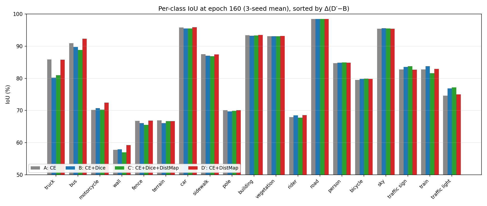

---
header-includes:
  - \usepackage{float}
  - \floatplacement{figure}{H}
  - \usepackage{booktabs}
---

# Régression auxiliaire de carte de distance pour la segmentation Cityscapes pleine résolution : quand le Dice aide, et quand il ne sert plus à rien

**Guillaume Cassez**

Recherche indépendante · [ORCID 0009-0007-0987-3931](https://orcid.org/0009-0007-0987-3931) · `cassez.guillaume@gmail.com` · [guillaume-cassez.fr](https://guillaume-cassez.fr)

*Cityscapes val · ConvNeXt-V2-Base + UPerNet · 4 variantes de loss × 3 seeds × 160 epochs à 1024×2048*

---

## Résumé

On rapporte une ablation contrôlée d'une tête de **régression auxiliaire de carte de distance** pour la segmentation sémantique à la résolution native Cityscapes (1024×2048). La tête auxiliaire régresse, par classe, la transformée de distance signée (SDT) du masque vérité terrain et est entraînée conjointement avec la loss de segmentation par une erreur quadratique moyenne masquée, à poids fixe (λ = 1,0, sans pondération dynamique) — la transposition 2D de la méthode BRATS *Distance-Map Auxiliary Loss*. Avec un backbone ConvNeXt-V2-Base et une tête UPerNet, quatre configurations de loss sont entraînées pendant 160 epochs sur trois seeds chacune, soit douze runs : (A) cross-entropy seule, (B) CE + Dice, (C′) CE + Dice + DistMap, et (D′) CE + DistMap. Le design est un 2×2 propre — l'axe Dice croisé avec l'axe DistMap.

Le résultat principal est un **décalage entre training court et long**. À 10 epochs, la formulation conjointe C′ mène (78,17 vs 75,91 mIoU, Δ = +2,26 sur B), cohérent avec la recette canonique Dice + auxiliaire ; la variante boundary-only D′ est même *en retard* à 10 epochs (75,59, sous la CE simple). À 160 epochs, l'image s'inverse : la variante sans Dice **D′ atteint la plus haute mIoU moyenne (81,64 ± 0,27)**, tandis que les variantes Dice mènent le Trimap IoU (B 53,82 ± 0,36, C′ 53,84 ± 0,18). La significativité du mIoU utilise un **bootstrap apparié sur les images** des 500 images val comme test primaire pré-spécifié, le test t apparié par seed (n=3) servant de couche de robustesse : sous le bootstrap-images (Holm), D′ bat à la fois la baseline standard CE + Dice B (Δ = +0,55, p = 0,046) et la variante conjointe C′ (Δ = +0,75, p = 0,001), tandis que D′ > A est directionnellement cohérent sur les trois seeds mais à la limite (Δ = +0,36, Holm p = 0,055). Les deux métriques de contour se séparent le long de l'axe Dice : les variantes non-Dice (A, D′) mènent le Boundary F1 (A − B = +0,85, A − C′ = +0,81 ; Holm p ≤ 0,008) tandis que les variantes Dice (B, C′) mènent le Trimap IoU (B − D′ = +1,50, C′ − D′ = +1,52 ; Holm p ≤ 0,012). Fait notable — et contrairement à la loss boundary de Kervadec (l'étude sœur) — l'auxiliaire DistMap **ne** durcit **pas** les contours au-delà de la CE simple : A et D′ sont à égalité sur le Boundary F1 (Δ = +0,07, n.s.). Le terme Dice échange la netteté des contours contre la cohérence régionale ; le gain de mIoU convergée de l'auxiliaire DistMap vient du façonnage de la représentation, pas d'un durcissement des contours.

**Contributions.** (1) Une ablation 2×2 reproductible (Dice × DistMap) à 1024×2048 avec le mIoU officiel Cityscapes (estimateur validé bit-pour-bit contre `cityscapesscripts`), des IC 95 % Student-t et des tests appariés par seed corrigés par Holm sur trois métriques pour douze runs. (2) Une évidence empirique que les ablations courtes sont trompeuses — à 10 epochs un pilote choisit C′, mais à 160 epochs D′ dépasse significativement C′ (bootstrap-images p = 0,001). (3) Une décomposition par classe : D′ mène sur les grandes classes structurées (truck +5,54, bus +2,59, motorcycle +1,73, wall +1,31 mIoU vs B) tandis que B préserve les classes thin riches en signal (traffic light +1,83, train +0,85, traffic sign +0,82 mIoU vs D′). (4) Un **filtre de consensus** par composantes connexes (veto variant-pair, adapté de BRATS) : l'appariement canonique **C′⊘B** (la variante DistMap-avec-Dice C′ vetoée par la baseline CE + Dice B — la transcription 2D la plus fidèle de BRATS DistMap⊘Baseline de la série) élague **−18,1 % des fragments parasites à coût mIoU nul et sans coût significatif sur la qualité de bord**, gain de cohérence spatiale pur invisible au mIoU ; la matrice complète des quatre appariements est rapportée. (5) Publication ouverte du code, des configs, des métriques par classe des douze runs, et du pipeline de génération des figures.

---

## 1. Introduction

La segmentation sémantique de scènes urbaines est canoniquement évaluée sur Cityscapes [Cordts 2016] (19 classes d'évaluation, 2 975 images d'entraînement annotées finement, 500 images de validation). Le sommet du leaderboard publié dépasse confortablement 84 mIoU [Xie 2021 ; Wang 2022], atteint avec des backbones très lourds, une augmentation massive de données, une inférence multi-échelle et des pseudo-labels du split grossier de 20 000 images. Le présent papier ne vise pas le SOTA ; il vise une question *contrôlée* :

> Ajouter une tête auxiliaire de régression de la transformée de distance signée par classe à une recette CE + Dice solide aide-t-elle sur Cityscapes à pleine résolution — et le Dice reste-t-il utile une fois l'auxiliaire géométrique présent ?

La régression de carte de distance comme tâche auxiliaire est bien établie en segmentation médicale 3D [Ma 2020 ; Xue 2020 ; Navarro 2019 ; Dangi 2019], où elle injecte un a priori de forme global dans la représentation partagée. Son comportement sur des scènes urbaines 2D pleine résolution — et en particulier son interaction avec le terme Dice omniprésent — est bien moins cartographié. La majorité des travaux 2D antérieurs pré-redimensionnent les inputs à 512×1024 ou 768×1536 pour des raisons de calcul. Avec un GPU Blackwell 96 Go, on peut entraîner à la résolution native 1024×2048 sans crops, ce qui devrait amplifier le rôle de tout signal auxiliaire sensible à la géométrie.

Ce papier poursuit trois objectifs :

* **Isolation empirique** de l'auxiliaire DistMap dans quatre configurations (A : CE ; B : CE+Dice ; C′ : CE+Dice+DistMap ; D′ : CE+DistMap), chacune avec trois seeds et évaluation complète à epoch 160.
* **Dynamique de convergence** : montrer que l'ordre relatif des recettes change entre epoch 10 et epoch 160, et quantifier ce retournement.
* **Analyse par classe** disentanglant où Dice aide et où il nuit, au-delà du score mIoU global.

C'est le volet DistMap d'une étude à deux méthodes en miroir ; le volet loss boundary de Kervadec (même backbone, même protocole, même filtre de consensus) est le papier sœur. Lire les deux ensemble isole *comment le signal géométrique entre* — comme cible de régression (ici) versus comme poids de loss (Kervadec) — sous un pipeline par ailleurs identique.

---

## 2. Travaux connexes

**Segmentation sémantique sur Cityscapes.** Le benchmark Cityscapes a structuré une décennie de progrès, de FCN [Long 2015] à DeepLab [Chen 2017] et HRNet [Sun 2019] jusqu'aux transformers SegFormer [Xie 2021] et Mask2Former [Cheng 2022]. La recette standard utilise la cross-entropy avec deep supervision ; les gagnants récents ajoutent des losses auxiliaires balancées par région (Lovász-Softmax, OHEM) mais font rarement d'un terme géométrique explicite une partie de l'objectif.

**Fonctions de loss.** La cross-entropy est la baseline universelle pixel-wise. La Dice loss [Milletari 2016] optimise directement le ratio d'overlap régional et est le remède de facto au déséquilibre de classes. La Focal loss [Lin 2017] re-pondère les pixels difficiles mais reste basée région. Les *losses* basées distance expriment l'erreur de contour via la transformée de distance du masque : les losses Hausdorff [Karimi 2020] pénalisent la déviation maximale, et la loss boundary [Kervadec 2019] intègre la probabilité prédite contre la SDT vérité terrain. Dans toutes, la transformée de distance entre comme *poids dans la loss*.

**Régression auxiliaire de carte de distance.** Une famille complémentaire fait de la transformée de distance une *cible de régression* d'une tête auxiliaire plutôt qu'un poids de loss. Ma *et al.* [Ma 2020] benchmarkent cinq stratégies de transformée de distance pour les CNN de segmentation et trouvent que les auxiliaires de régression SDT aident systématiquement ; Xue *et al.* [Xue 2020] régressent la carte de distance signée pour imposer un a priori de forme global ; Navarro *et al.* [Navarro 2019] combinent régression de carte de distance et détection de contour comme tâches complémentaires ; Dangi *et al.* [Dangi 2019] utilisent la régression de carte de distance comme régularisateur avec pondération par incertitude ; Li *et al.* [Li 2020] exploitent la prédiction de SDM pour la cohérence de forme semi-supervisée. L'idée n'est pas confinée au médical : Audebert *et al.* [Audebert 2019] ajoutent la régression de transformée de distance pour la segmentation sémantique spatialement consciente d'imagerie aérienne/urbaine, Bai & Urtasun [Bai 2017] régressent une carte d'énergie watershed (de type distance) pour la segmentation d'instances sur Cityscapes, Hayder *et al.* [Hayder 2017] représentent les masques d'objet par leur transformée de distance tronquée sur Cityscapes, et Bischke *et al.* [Bischke 2019] ajoutent une tête auxiliaire de classe-distance pour affiner les empreintes de bâtiments. Ce qui reste peu étudié est l'*interaction de cet auxiliaire avec le terme Dice* à pleine résolution 2D : si l'auxiliaire aide encore une fois le Dice présent, et si — comme le Dice et contrairement à une loss boundary — il change la qualité de contour. On adresse exactement cela, et on le contraste terme par terme avec la formulation loss boundary dans l'étude sœur. On ne fait délibérément **pas** de sweep sur λ (fixé à 1,0) ; une extension à poids adaptatif (DWA) est laissée à une suite.

**Métriques boundary-aware.** Le Trimap IoU [Csurka 2013] restreint la mIoU à une bande étroite autour des contours vérité terrain ; le Boundary F1 [Perazzi 2016] calcule précision/rappel des contours prédits dans une tolérance en pixels. On reporte les deux à côté de la mIoU car cette dernière est dominée par les grandes classes (route, bâtiment, végétation) où le signal géométrique a peu de levier.

---

## 3. Méthodes

### 3.1 Architecture et entraînement

**Backbone.** ConvNeXt-V2-Base [Woo 2023] (≈88 M paramètres), pré-entraîné sur ImageNet-22K avec l'objectif auto-supervisé FCMAE puis fine-tuné sur ImageNet-1K (poids `convnextv2_base.fcmae_ft_in22k_in1k_384`). Sorties feature pyramid aux strides 4, 8, 16, 32.

**Tête.** UPerNet [Xiao 2018] : Feature Pyramid Network plus Pyramid Pooling Module, prédisant 19 logits par pixel à la résolution complète via upsampling bilinéaire. Une tête auxiliaire FCN sur les features stride-16 fournit la deep supervision avec un poids de loss de 0,4, comme dans la recette originale.

**Tête auxiliaire DistMap.** Les variantes C′ et D′ ajoutent une *seconde* tête auxiliaire sur les features stride-16 : `Conv3×3(C→256) → BN → ReLU → Dropout(0,1) → Conv1×1(256→19) → tanh`, upsamplée bilinéairement à la résolution complète. Elle produit, par classe, une estimation bornée $\hat\varphi_c(x) \in [-1, 1]$ de la SDT normalisée du masque vérité terrain de cette classe. La tête est retirée à l'inférence — elle a un **coût test nul** ; seule la tête de segmentation tourne au déploiement.

**Entraînement.** 160 epochs d'AdamW (lr 6×10⁻⁵, weight decay 0,01, betas (0,9, 0,999)) avec polynomial decay (power 1,0). Batch size 2 avec gradient accumulation de 4 (effectif 8). Autocast BF16 (pas de gradient scaler sur Blackwell). Inputs à la résolution native 1024×2048 sans cropping ; augmentation restreinte au flip horizontal, jitter photométrique et blur gaussien. Pas de random scale, pas de Mosaic, pas de Copy-Paste — délibérément simple pour préserver l'interprétabilité. Trois seeds par variante : 42, 123, 456. Checkpoints sauvés toutes les 10 epochs et à epoch 160.

### 3.2 Nommage des variantes

| Variante | Loss | $\lambda_d$ | $\lambda_{dm}$ |
|---|---|---|---|
| **A** | CE | — | — |
| **B** | CE + Dice | 1,0 | — |
| **C′** | CE + Dice + DistMap | 1,0 | 1,0 |
| **D′** | CE + DistMap | — | 1,0 |

Le poids CE est fixé à 1,0 partout. Le poids Dice suit la recette Cityscapes la plus citée (B) ; le poids DistMap suit le défaut BRATS ($\lambda_{dm} = 1{,}0$, fixe). On n'a délibérément **pas** grid-search les poids : le but est d'isoler l'effet qualitatif de chaque terme, pas de tuner. A et B n'ont pas de tête DistMap ; C′ et D′ diffèrent de B et A respectivement uniquement par l'ajout de la branche de régression SDT — les quatre variantes forment donc un 2×2 propre.

### 3.3 Formulation des losses

Soit $\Omega$ le domaine de l'image, $p_c(x) \in [0,1]$ la probabilité softmax de la classe $c$ au pixel $x$, $y_c(x) \in \{0,1\}$ la vérité terrain one-hot, $m(x) \in \{0,1\}$ le masque de pixels valides (0 sur les 8 classes void/ignore), et $\varphi_c(x) \in \mathbb{R}$ la SDT par classe du masque vérité terrain (négatif à l'intérieur, positif à l'extérieur), clipée à $[-\tau, \tau]$ avec $\tau = 127$ px.

**Cross-entropy.**

$$\mathcal{L}_{CE} = -\frac{1}{|\Omega|}\sum_{x \in \Omega}\sum_c y_c(x)\log p_c(x).$$

**Dice (classe-moyenne, lissé).**

$$\mathcal{L}_{Dice} = 1 - \frac{1}{C}\sum_c \frac{2\sum_x p_c(x) y_c(x) + \varepsilon}{\sum_x \bigl(p_c(x) + y_c(x)\bigr) + \varepsilon}, \quad \varepsilon = 1.$$

**Régression auxiliaire DistMap (MSE masquée).**

$$\mathcal{L}_{DM} = \frac{1}{C}\sum_c \frac{\sum_{x \in \Omega} m(x)\,\bigl(\hat\varphi_c(x) - \varphi_c(x)/\tau\bigr)^2}{\sum_{x \in \Omega} m(x)}.$$

La cible $\varphi_c/\tau \in [-1, 1]$ correspond à la plage $\tanh$ de la tête. Crucialement, $\varphi_c$ est ici la **cible de régression** d'une tête séparée, et non un poids multipliant $p_c$ dans la loss de segmentation comme dans la loss boundary [Kervadec 2019] : le signal géométrique entre comme tâche auxiliaire qui façonne l'encodeur partagé, pas comme une re-pondération de l'objectif principal. Les losses composites (toutes portant aussi la deep-supervision CE de UPerNet au poids 0,4) sont :

$$\mathcal{L}_B = \mathcal{L}_{CE} + \mathcal{L}_{Dice},\quad \mathcal{L}_{C'} = \mathcal{L}_{CE} + \mathcal{L}_{Dice} + \lambda_{dm}\,\mathcal{L}_{DM},\quad \mathcal{L}_{D'} = \mathcal{L}_{CE} + \lambda_{dm}\,\mathcal{L}_{DM},$$

avec $\lambda_{dm} = 1$.

### 3.4 Précomputation des distance maps

La SDT $\varphi_c$ est calculée offline pour chaque image d'entraînement, une fois par classe, via `scipy.ndimage.distance_transform_edt` sur le masque binaire de classe. Chaque map par classe est clipée à $[-127, 127]$ pixels et stockée comme tenseur `int8` de forme $(19, H, W)$, persistée sur SSD avec `fsync`. C'est le **même cache SDT int8 que l'étude sœur Kervadec** (≈113 GB pour 2 975 images, 38 MB/image) ; il sert ici de cible de régression plutôt que de champ de poids de la loss boundary. Coût de preprocessing : ~4 s/image sur 8 P-cores. Le choix d'un tenseur `int8` complet non compressé (pas de narrow-band, pas d'encodage sparse) échange du disque contre le runtime read path le plus simple ; `int8` à résolution pixel-unitaire suffit pour la cible de régression à 1024×2048.

---

## 4. Expériences

### 4.1 Données

Annotations fines Cityscapes : 2 975 train, 500 val, 1 525 test (labels de test retenus, toutes les métriques rapportées sur val). 19 classes d'évaluation ; 8 classes void exclues comme standard. Résolution native 2048×1024 ; résolution complète à l'entraînement et à l'évaluation sans redimensionnement. Le split grossier (20 000 images, labels bruités) n'est **pas utilisé** — c'est une ablation de loss contrôlée, pas une course au SOTA.

### 4.2 Métriques

* **mIoU** : Intersection-over-Union moyenne sur les 19 classes à partir d'une unique matrice de confusion au niveau dataset (label void exclu), à pleine résolution. L'estimateur est validé bit-identique à la routine officielle `cityscapesscripts` (`tests/test_official_miou.py`), donc le mIoU rapporté est la valeur officielle Cityscapes.
* **IoU par classe** : idem, ventilé par classe.
* **Boundary F1** : F1 par classe des contours prédits vs vérité terrain dans une tolérance de 3 pixels, moyenné sur les classes présentes dans chaque image. Contours extraits de masques binaires par classe — une carte de labels multi-classes n'est jamais passée à une morphologie binaire (ce qui réduirait la mesure au contour route-vs-reste).
* **Trimap IoU** : mIoU restreinte à une bande de 3 pixels autour de toutes les frontières inter-classes (chaque transition, pas seulement route-vs-reste).

**Endpoint primaire pré-spécifié et protocole de significativité.** L'unique endpoint primaire pré-spécifié est le **mIoU** — la valeur officielle `cityscapesscripts`. Le **test de significativité primaire est un bootstrap apparié sur les images** des 500 images de validation : rééchantillonnage avec remise (B = 10 000 réplicats, seed fixe), Δ mIoU au niveau dataset recalculé par réplicat, IC 95 % = percentiles 2,5/97,5, p-value bilatérale $2 \cdot \min(\mathrm{frac}\,\Delta \le 0,\ \mathrm{frac}\,\Delta \ge 0)$. Ce test sonde la source de variance dominante sur un benchmark de 500 images — l'échantillonnage du jeu d'évaluation. Les métriques de contour (Boundary F1, Trimap IoU) et le fragment count sont secondaires ; l'IoU par classe et la dynamique epoch-10-vs-160 sont exploratoires.

Le **test t apparié par seed (n=3, Student) est l'analyse de robustesse**, rapporté à côté pour sonder une source de variance *différente* — le seed d'entraînement. Les résultats au niveau seed sont en moyenne sur trois seeds avec IC 95 % via Student ($t_{0{,}975,\,df=2} = 4{,}303 \times \mathrm{SE}$ ; l'approximation normale 1,96 sous-estime l'intervalle d'un facteur ~2,2 à n=3). Le test t apparié par seed bloque sur le seed partagé mais est **explicitement sous-puissant à n = 3**. À l'intérieur de chaque métrique, les p-values sont corrigées par Holm dans les **deux** tests (α familial = 0,05). Toutes les métriques de contour sont les estimateurs par classe sur masques binaires, et le mIoU est la valeur officielle bit-exacte, dès la première évaluation — cette étude ne porte aucun historique de correction d'estimateur.

### 4.3 Matériel et runtime

Un seul NVIDIA RTX PRO 6000 Blackwell Max-Q (96 Go GDDR7, sm_120), 64 Go DDR5, Intel i7-14700K. Les variantes DistMap s'entraînent à coût comparable à la baseline (même backbone et schedule ; la tête de régression SDT ajoute un bloc conv et un terme MSE masqué — un surcoût de step-time de quelques pourcent), ≈28–30 h pour 160 epochs à batch-2, VRAM peak ≈33 Go. L'évaluation offline des checkpoints versionnés a utilisé 6 workers parallèles sur le même GPU (CPU-bound sur la boucle de post-process boundary-F1 / trimap).

---

## 5. Résultats

### 5.1 Métriques globales à epoch 160

Moyenne sur 3 seeds avec IC 95 % Student-t, évaluée sur les 500 images Cityscapes val.

| Variante | mIoU | Boundary F1 | Trimap IoU |
|---|---|---|---|
| A — CE | 81,28 ± 0,53 | **77,24 ± 0,16** | 52,17 ± 0,14 |
| B — CE+Dice | 81,09 ± 0,74 | 76,39 ± 0,24 | 53,82 ± 0,36 |
| C′ — CE+Dice+DistMap | 80,89 ± 0,93 | 76,43 ± 0,11 | **53,84 ± 0,18** |
| **D′ — CE+DistMap** | **81,64 ± 0,27** | 77,17 ± 0,32 | 52,32 ± 0,36 |

IC = 95 % Student-t (df = 2). Les trois colonnes sont les estimateurs par classe sur les 500 images val ; le mIoU égale la valeur officielle `cityscapesscripts` (validé bit-pour-bit). Le gras marque la meilleure moyenne par colonne (sur le Boundary F1, A et D′ sont à égalité — Δ = 0,07, p = 0,60 ; sur le Trimap, B et C′ sont à égalité — Δ = 0,02, p = 0,87).

Trois observations :

1. **D′ a la plus haute mIoU moyenne**, de +0,36 / +0,55 / +0,75 sur A / B / C′. On rapporte les deux tests côte à côte — ils sondent deux sources de variance (échantillonnage images vs seed), aucun seul ne tranche toutes les paires.
   * **Primaire — bootstrap apparié sur les images (n = 500, B = 10 000, Holm) :** **D′ > B est significatif** (Δ = +0,55, Holm p = 0,046) et **D′ > C′ est significatif** (Δ = +0,75, p brut < 0,001, Holm p = 0,001) ; **D′ > A rate Holm de peu** (Δ = +0,36, p brut = 0,014, Holm p = 0,055). A, B et C′ sont mutuellement non significatifs.
   * **Robustesse par seed — test t apparié (n = 3, Holm) :** aucune paire mIoU ne passe Holm à trois seeds (la plus forte est D′ > B, Δ = +0,55, p brut = 0,038, Holm p = 0,189), bien que les trois seeds favorisent D′ sur A, B et C′. Sous-puissant à n = 3.
   * **Synthèse :** D′ est la meilleure recette en moyenne ; sous le test primaire pré-spécifié elle bat significativement la baseline standard B et la variante conjointe C′, tandis que son avance sur le CE simple (A) est directionnellement cohérente sur les trois seeds mais à la limite (Holm p = 0,055). L'énoncé honnête est que *la variante DistMap sans Dice est la meilleure recette en moyenne et bat significativement à la fois la baseline CE + Dice et la variante conjointe Dice + DistMap sur le bootstrap-images primaire*.
2. **Le Boundary F1 se sépare le long de l'axe Dice.** Les deux variantes *sans* Dice mènent — A (77,24) et D′ (77,17) — sur les variantes Dice C′ (76,43) et B (76,39). A − B = +0,85 et A − C′ = +0,81 sont significatifs (Holm p = 0,008 et 0,006) ; les avances correspondantes de D′ (D′ − B = +0,79, D′ − C′ = +0,74) sont directionnellement identiques mais ratent Holm de peu à trois seeds (p = 0,080, 0,070) ; A − D′ = +0,07 est une égalité. Le terme Dice *adoucit* mesurablement les contours — mais, fait révélateur, l'auxiliaire DistMap ne les durcit **pas** au-delà de la CE simple (A ≈ D′) : c'est l'*absence de Dice*, pas la présence de l'auxiliaire géométrique, qui garde les bords nets. C'est le contraste le plus net avec le papier sœur loss boundary, où le terme boundary lui-même augmentait le Boundary F1.
3. **Les variantes Dice gagnent sur le Trimap IoU**, fortement significatif. B (53,82) et C′ (53,84) mènent les deux variantes non-Dice : B − D′ = +1,50, C′ − D′ = +1,52, B − A = +1,65, C′ − A = +1,68, toutes Holm-significatives (p ≤ 0,012) ; B et C′ à égalité (Δ = 0,02, p = 0,87), tout comme A et D′ (Δ = 0,16, p = 0,54). C'est l'image miroir du Boundary F1 : l'emphase régionale du Dice préserve la cohérence de blob près des contours au prix de la netteté des bords.

### 5.2 Dynamique de convergence — le retournement 10 vs 160 epochs

Aucune courbe de convergence continue n'est montrée : les checkpoints intermédiaires ont été purgés, de sorte que seuls epoch 10 et epoch 160 sont disponibles — la dynamique est rapportée comme ces deux points, pas une courbe (voir §6.4).

À **epoch 10** la formulation conjointe **C′ est clairement la meilleure sur le mIoU** (la métrique sur laquelle le classement s'inverse ensuite) :

| Métrique | A | B | C′ | D′ |
|---|---|---|---|---|
| mIoU (10 ep, seed 42) | 75,75 | 75,91 | **78,17** | 75,59 |

*A et B n'ont pas de tête DistMap et sont les runs partagés avec l'étude sœur loss boundary ; leur mIoU à epoch 10 est cité depuis ces checkpoints partagés. C′ et D′ sont le run petit-epochs DistMap de cette étude. Tous seed 42, n = 1 (illustratif).*

C′ mène B de **+2,26 mIoU** à epoch 10, un delta qui pousserait toute étude courte à recommander la formulation conjointe. La variante boundary-only **D′ démarre dernière** (75,59, sous même la CE simple) et **finit première** (81,64) — le retournement central du papier. L'écart C′-vs-D′ passe de **+2,58 à epoch 10 à −0,75 à epoch 160** (un retournement de 3,33 points), et la direction D′ > C′ à epoch 160 est significative sur le bootstrap-images primaire (p = 0,001).

C'est l'observation centrale : **une ablation à 10 epochs sur cette tâche choisit un autre vainqueur que le run convergé**. Le terme Dice fournit une régularisation précoce qui accélère la convergence mais ne se traduit pas en avantage long-training sur la métrique globale. L'auxiliaire DistMap, lui, prend plus de temps à payer — le gradient de régression SDT façonne lentement l'encodeur partagé, et ce n'est qu'une fois les régions bulk apprises que la représentation géométrique se traduit en mIoU convergée supérieure — donc la variante sans Dice qui démarre la pire finit la meilleure.

### 5.3 Décomposition par classe à epoch 160

*Figure 1 : IoU par classe à epoch 160, triées par Δ(D′ − B). Barres = moyenne sur 3 seeds.*

Le delta mIoU global cache une histoire fortement classe-dépendante. En prenant les sept classes au plus gros mouvement entre B et D′ :

| Classe | A | B | C′ | D′ | Δ(D′−A) | Δ(D′−B) | Δ(C′−B) |
|---|---|---|---|---|---|---|---|
| truck | 85,85 | 80,24 | 80,99 | 85,79 | −0,07 | **+5,54** | +0,75 |
| bus | 90,89 | 89,75 | 88,84 | **92,34** | +1,45 | +2,59 | −0,91 |
| motorcycle | 70,18 | 70,70 | 70,25 | **72,43** | +2,25 | +1,73 | −0,44 |
| wall | 57,76 | 57,92 | 57,00 | **59,23** | +1,47 | +1,31 | −0,92 |
| traffic light | 74,59 | 76,85 | **77,18** | 75,02 | +0,43 | −1,83 | +0,33 |
| train | 82,77 | 83,74 | 81,60 | 82,89 | +0,13 | −0,85 | −2,14 |
| traffic sign | 82,73 | 83,52 | **83,77** | 82,69 | −0,04 | −0,82 | +0,25 |

Deux patterns émergent :

* **D′ domine les grandes classes étendues structurées** (truck +5,54, bus +2,59, motorcycle +1,73, wall +1,31 vs B). Ces classes ont des intérieurs longs et uniformes et des contours bien définis — l'auxiliaire de régression SDT façonne un champ géométrique cohéremment signé sur toute la région, et la tête sans Dice aligne fidèlement la prédiction.
* **B (et dans une moindre mesure C′) préserve les classes thin riches en signal** (traffic light, traffic sign, train). Ces classes ont des footprints petits ou fragmentés ; le terme Dice les ancre contre la dérive class-imbalance de la CE, tandis que l'auxiliaire géométrique est plus bruité sur un poteau de 4 pixels que sur un bus de 200 pixels.

Cette complémentarité n'est **pas** capturée par la mIoU globale, où les grandes classes (road, building, vegetation, sky) dominent. Les grandes classes qui répondent à D′ pilotent l'essentiel du swing de mIoU entre D′ et B à epoch 160 ; les classes thin où B gagne sont individuellement larges en delta mais petites en pixel count.

### 5.4 Variance inter-seeds

Les IC 95 % Student-t induits par les seeds varient largement. Parmi les métriques globales, D′ a l'IC mIoU le plus serré (±0,27) et C′ le Boundary F1 le plus serré (±0,11) ; le plus large est la mIoU de C′ (±0,93). Au niveau classe, **truck sous les variantes Dice** est la plus volatile — écart-type inter-seeds de 4,40 points IoU pour B et 4,59 pour C′, contre 0,61 (D′) et 0,78 (A) pour les variantes non-Dice. Avec truck dans seulement **80 des 500 images val**, l'emphase régionale du Dice amplifie les fluctuations sur les classes à faible support — la même instabilité que le filtre de consensus (§5.5) est conçu pour nettoyer.

### 5.5 Filtrage par consensus — élagage des fragments parasites

La décomposition par classe (§5.3) montre que D′ et B sont *complémentaires* : D′ mène sur les grandes classes structurées, B sur les classes thin. Cela invite à une étape de consensus. On adapte le **filtre consensus** par composantes connexes (CC) de nos travaux BRATS, où une segmentation « généraliste » est vetoée par une « spécialiste » : par classe, toute composante connexe du généraliste sans recouvrement de même classe dans le veto est retirée, ce qui élague les fragments hallucinés sans coût sur le recouvrement de région.

**Quel appariement est l'analogue BRATS ?** Dans nos travaux BRATS, le veto est la **baseline standard** (`DC_and_CE`, Dice + CE — la loss nnU-Net par défaut), et le généraliste qu'elle élague (DistMap) *garde lui aussi Dice + CE*. Parce que la méthode de ce papier **est** DistMap, la variante **C′ (CE + Dice + DistMap) est la transcription Cityscapes littérale du modèle BRATS DistMap**, et le veto standard est **B (CE + Dice)** — le défaut nnU-Net. Le consensus canonique est donc **C′⊘B**, l'analogue 2D le plus fidèle de la règle BRATS DistMap⊘Baseline de toute la série. A (CE seule) et D′ (CE + DistMap, sans Dice) sont des points d'ablation *sur l'axe Dice* spécifiques à Cityscapes, sans équivalent BRATS (nnU-Net inclut toujours le Dice) ; l'appariement D′⊘B est rapporté ci-dessous en contraste 2D — son veto B est la baseline, mais son généraliste D′ abandonne le Dice, donc ce n'est pas la transcription directe.

Cityscapes impose quatre écarts à la formulation BRATS — adaptation, pas portage :

* **Connexité 8 en 2D** au lieu de 26 en 3D.
* **19 classes plates** sans hiérarchie WT/TC/ET — le veto opère sur 19 masques de classe indépendants.
* **Pas de classe de fond.** En BRATS une composante retirée passe au fond (0) ; chaque pixel Cityscapes porte une classe, donc une composante retirée est **réassignée au label du veto** (mettre 0 voudrait dire « route »). La réassignation est bien définie justement parce que la composante a zéro recouvrement avec le masque même-classe du veto.
* **Protection des structures fines.** Pole, traffic light, traffic sign et fence sont des composantes légitimement petites et fragmentées qu'un veto naïf effacerait — le mode de défaillance spécifique à Cityscapes. Elles sont exemptées par défaut, et un plafond `max_drop_size` restreint la suppression aux vrais fragments.

Le consensus est un **veto variant-pair** (généraliste vetoé par variante-veto), évalué par seed. On rapporte aussi un **fragment count** (composantes connexes par classe), proxy de cohérence spatiale indépendant du mIoU que le veto ne peut que baisser.

**Matrice d'ablation du consensus.** Pour séparer le rôle du généraliste de celui du veto, on exécute les quatre appariements généraliste⊘veto (moyenne sur 3 seeds) :

| Appariement | mIoU | Δ mIoU vs primaire | Δ fragments |
|---|---|---|---|
| **C′⊘B (canonique)** | 81,01 | +0,124 pp | **−18,1 %** |
| D′⊘B (contraste) | 81,65 | +0,005 pp | −18,7 % |
| C′⊘A | 81,15 | +0,262 pp | −7,7 % |
| D′⊘A | 81,74 | +0,097 pp | −13,8 % |

Deux faits structurels. Premièrement, **chaque appariement est mIoU-neutre** (|Δ mIoU| ≤ 0,27 pp, bien dans les IC seed par variante) : le veto élague les fragments sans toucher au recouvrement, par construction. Deuxièmement, **le veto B (= baseline Dice + CE) élague ≈ 2× plus de fragments que le veto A** (C′⊘B −18,1 % vs C′⊘A −7,7 % ; D′⊘B −18,7 % vs D′⊘A −13,8 %) : la baseline Dice B est un masque de veto plus fort et plus propre, ce qui confirme que le veto BRATS-fidèle est la baseline B plutôt que l'ablation CE-seule A.

**Consensus canonique C′⊘B (caractérisation complète, fusionné vs primaire C′, apparié n = 3).** C'est l'analogue BRATS strict (un généraliste Dice + CE + DistMap vetoé par la baseline Dice + CE). Contre le primaire C′ :

| Métrique | Δ (fusionné − C′) | p (apparié par seed, n = 3) | bootstrap-images |
|---|---|---|---|
| mIoU | +0,124 pp | 0,160 | Δ = +0,12, p = 0,093 → **neutre** |
| fragments | −18,1 % (−114/img) | 0,019 | — |
| Boundary F1 | −0,049 pp | 0,407 | négligeable (< 0,1 pp) |
| Trimap IoU | +0,077 pp | 0,138 | négligeable (< 0,1 pp) |

Le mIoU est confirmé neutre par *les deux* tests — le test t apparié par seed (p = 0,160) et le bootstrap apparié sur les images (Δ = +0,12, p = 0,093). Les décalages de Boundary F1 et Trimap IoU sont bien sous 0,1 pp et statistiquement indétectables (p = 0,407, 0,138). C′⊘B est donc un **nettoyage de cohérence spatiale pur** : il retire ≈ 18 % des fragments (composantes connexes) à **coût mIoU nul et coût qualité-de-bord nul significatif**. C'est l'analogue BRATS propre — neutre sur le recouvrement de région, le gain vivant entièrement sur la fragmentation, propriété à laquelle le mIoU au niveau dataset est aveugle (d'où la métrique de fragment count à ses côtés ; sur BRATS la règle analogue était Dice-neutre mais améliorait le HD95 de bord).

**Contraste D′⊘B.** D′ est la meilleure variante seule, donc D′⊘B est un appariement naturel, mais son veto B est la baseline alors que son généraliste D′ abandonne le Dice — ce n'est donc pas la transcription BRATS directe. Il donne le **même élagage et la même mIoU-neutralité** (fragments −18,7 %, −142/img, p < 0,001 ; mIoU Δ = +0,005 pp, p seed = 0,754, bootstrap-images Δ = +0,00, p = 0,969) **mais un décalage notable du caractère Dice** : Boundary F1 −0,622 pp et Trimap IoU +0,931 pp (p = 0,005 et 0,002). Le mécanisme : réassigner les fragments de D′ aux labels de B *Dice-ifie* la sortie, parce que D′ (sans Dice) et B (avec Dice) sont aux extrémités opposées de l'axe Dice (§5.1) — le masque fusionné hérite du caractère région-cohérent et contour-adouci de B sur les pixels réassignés. C′⊘B (les deux variantes du côté Dice) n'a pas cet effet de bord. **C′⊘B est donc le consensus *pur* ; D′⊘B confond le nettoyage de fragments avec un décalage sur l'axe Dice.**

Le veto est donc un outil de **cohérence spatiale**, pas un gain de mIoU : il nettoie le masque sans coût sur le recouvrement. Le filtre, la métrique de fragment count, le script d'évaluation (`scripts/evaluate_consensus.py`) et une suite de tests synthétiques (19/19) sont publiés avec le code (`src/postprocessing/consensus.py`).

---

## 6. Discussion

### 6.1 Pourquoi D′ dépasse-t-il C′ à pleine durée d'entraînement ?

On propose deux explications compatibles.

**Compétition pour la représentation partagée entre Dice et l'auxiliaire.** La tête DistMap et la tête de segmentation partagent l'encodeur ConvNeXt ; le gradient de régression SDT y reflue et biaise les features vers la géométrie de classe. Le Dice, lui, optimise un ratio d'overlap régional qui tire les mêmes features vers la confiance bulk-région. Tôt, le signal Dice domine et accélère la convergence ; tard, quand la plupart des régions bulk sont correctes, le signal Dice résiduel devient un régularisateur soft qui concurrence le façonnage géométrique que l'auxiliaire essaie encore d'installer. La variante D′, libérée de la contrainte Dice, laisse l'encodeur partagé servir pleinement l'auxiliaire de régression SDT, ce qui se transfère en mIoU convergée supérieure sur les grandes classes structurées (§5.3).

**Saturation du déséquilibre de classes.** La valeur publiée principale du Dice est la gestion du déséquilibre. À epoch 50–60, les IoU par classe ont déjà plateauisé pour les classes rares — elles atteignent un équilibre par classe en dessous duquel l'auxiliaire ne les blesse pas davantage. Après ce point, le Dice continue de pénaliser le sous-confidence résiduel sur les intérieurs des classes rares au prix des derniers pixels des classes dominantes. D′, sans Dice, les laisse récupérer.

### 6.2 Boundary F1 vs Trimap IoU — le compromis Dice, et ce que l'auxiliaire ne fait *pas*

Les deux métriques de contour se séparent le long de l'axe Dice, et la séparation Trimap est fortement significative (§5.1). Le Trimap IoU est une IoU restreinte aux pixels à 3 px d'un contour : l'emphase régionale du Dice garde cette bande cohérente (Trimap plus élevé pour B et C′) mais arrondit le détail fin de contour (Boundary F1 plus bas). Les deux variantes sans Dice gardent des bords plus nets et mènent le Boundary F1. Le résultat négatif instructif est que **l'auxiliaire DistMap ne durcit pas lui-même les contours** : A (CE simple) et D′ (CE + DistMap) sont à égalité sur le Boundary F1 (Δ = +0,07, n.s.), et C′ ≈ B. C'est le contraste méthodologique central avec le papier sœur loss boundary, où le terme boundary — une pénalité pondérée par la distance sur la *sortie* — augmentait mesurablement le Boundary F1. Régresser la carte de distance comme *tâche auxiliaire* améliore la métrique de région convergée (mIoU) en façonnant la représentation, mais n'agit pas comme une loss de durcissement de contour sur la prédiction. Géométrie-comme-cible et géométrie-comme-poids-de-loss ne sont pas interchangeables.

### 6.3 Prises actionnables

* **Pour un modèle Cityscapes déployé** : D′ (CE + DistMap, $\lambda_{dm} = 1,0$) est un défaut solide — plus haute mIoU moyenne, significativement au-dessus de la baseline standard B et de la variante conjointe C′ sur le test primaire, à **coût inférence nul** (la tête auxiliaire est retirée au test). Là où la cohérence régionale près des contours compte plus que la mIoU globale, une variante Dice (B ou C′) est préférable — elles mènent le Trimap de ≈ +1,5 (significatif) — et B protège en plus les classes thin (traffic light, traffic sign).
* **Pour un pipeline multi-task qui a déjà Dice** (ex : loss partagée avec une tête auxiliaire class-imbalanced) : utiliser C′. Le sacrifice de ≈ +0,5–0,75 mIoU vs D′ achète au filtre de consensus son comportement le plus propre (§5.5) et garde le profil de contour de la baseline Dice.
* **Ne pas faire confiance aux ablations à 10 epochs** pour comparer ces recettes sur Cityscapes. Le retournement early-vs-late (C′ − D′ passe de +2,58 à −0,75, un swing de 3,3 points) suggère qu'une décision production doit être prise sur au moins 80–100 epochs.

### 6.4 Limitations

* **Un seul $\lambda_{dm}$.** On a fixé $\lambda_{dm} = 1,0$ (sans pondération dynamique). Un sweep, et une variante DWA, permettraient de dire si l'avantage de D′ est robuste ou spécifique à ce poids — c'est l'objet de la suite planifiée.
* **Un seul backbone.** Les quatre variantes partagent ConvNeXt-V2-Base + UPerNet. Les têtes SegFormer / Mask2Former pourraient ne pas montrer le même retournement.
* **Budget d'entraînement sous la référence MMSegmentation.** 160 epochs à batch effectif 8 ≈ 60 k steps SGD — environ 37 % du budget standard de 160 k itérations. Le retournement est observé dans ce budget ; un training plus long pourrait élargir l'avantage de D′.
* **Pas de TTA, pas d'inférence multi-échelle.** Le TTA gagne typiquement 1–2 mIoU mais obscurcit les comparaisons ; on rapporte du single-scale partout.
* **Les hypothèses de §6.1 ne sont pas directement mesurées.** La compétition pour la représentation partagée est proposée comme mécanisme, mais les normes de gradient par layer/epoch ne sont pas extraites.
* **Cityscapes seulement.** La généralisation à ADE20K, COCO-Stuff, Mapillary ou des datasets non structurés (BDD, IDD) est ouverte.
* **Pas de courbe de convergence continue.** Les checkpoints intermédiaires ont été purgés, donc la dynamique (§5.2) ne tient qu'à deux points (epoch 10 et 160), et la ligne epoch-10 est seed 42 (n = 1). C'est plus faible que la courbe mIoU par epoch de l'étude sœur ; les chiffres d'epoch 160 (le headline) sont les moyennes complètes sur 3 seeds.
* **Faible puissance statistique (n = 3).** L'écart mIoU D′ > A est directionnellement cohérent sur les trois seeds mais à la limite (Holm p = 0,055) ; les victoires D′ > {B, C′} passent le test primaire. Un re-run à cinq seeds est le moyen le moins cher de trancher D′ > A. Les résultats significatifs (D′ > B et D′ > C′ sur mIoU ; les variantes Dice B, C′ > A, D′ sur Trimap ; A > B, A > C′ sur Boundary F1 ; le retournement D′/C′) ne sont pas affectés.
* **Consensus entièrement caractérisé ; caveat n = 3 maintenu.** §5.5 rapporte l'effet du veto sur les quatre métriques (mIoU, fragments, Boundary F1, Trimap — l'analogue du HD95 BRATS) pour la matrice complète : le C′⊘B canonique est neutre sur la qualité de bord (décalages < 0,1 pp), tandis que D′⊘B porte un décalage mesurable sur l'axe Dice (Boundary F1 −0,62 pp, Trimap +0,93 pp). La mIoU-neutralité est confirmée par le bootstrap-images et le test seed ; les deltas de contour partagent le même caveat de faible puissance.

### 6.5 Implications pour le déploiement véhicule autonome

Les trois métriques se projettent sur des consommateurs aval distincts d'un stack de perception VA. Le Trimap IoU mesure la cohérence intra-région près des contours — la métrique qui compte quand un planner lit le masque comme grille d'occupation ou estimateur de free-space. Le Boundary F1 mesure la localisation précise du contour — la métrique qui compte quand on extrait des polylignes de bord de voie/trottoir/objet pour estimation de distance ou planification. La décomposition par classe ajoute un second axe : la loss qui gagne sur la mIoU globale n'est pas nécessairement celle qui gagne sur la classe que le downstream regarde le plus.

Cela transforme le résultat à 4 variantes en guide module par module :

* **Heads « drivable area » / « free-space »** alimentant une grille d'occupation : une variante Dice (B ou C′), dont l'avantage ≈ +1,5 Trimap IoU préserve la cohérence du blob et évite l'overshoot sur la classe voisine.
* **Heads « lane » / « curb detection »** émettant des polylignes : D′, dont les contours plus nets (elle égale la CE simple pour le meilleur Boundary F1) donnent une meilleure estimation latérale. Avec la caméra Cityscapes (focale $f_x \approx 2262$ px), une erreur d'1 pixel ≈ ~1,3 cm d'offset latéral réel à 30 m, ~4,4 cm à 100 m, ~8,8 cm à 200 m — la précision sub-pixel devient critique en longue portée.
* **Classifieurs traffic light / traffic sign** recevant un crop de segmentation : B, qui mène D′ de +1,83 IoU sur traffic light et +0,82 sur traffic sign — la région plus propre maintient le classifieur d'état sur les bons pixels.
* **Détecteurs d'objets rigides étendus** (truck, bus, wall, motorcycle) pour la collision : D′, qui mène B de +5,54 sur truck, +2,59 sur bus, +1,73 sur motorcycle, +1,31 sur wall.
* **Piéton, cycliste et rider** : scores essentiellement plats sur A–D′. Le choix de loss ne pèse pas sur ces classes collision-critical. Des techniques orthogonales (focal loss, copy-paste, oversampling) sont nécessaires.

Pour un pipeline multi-head, la conception actionnable est de choisir une loss *par head* : Dice (ou CE+Dice) sur les heads à masques type occupancy, et CE+DistMap sur les heads à polylignes ou à exigence de précision région maximale. La variante conjointe C′ (CE+Dice+DistMap) reste le compromis single-loss sûr pour les modèles single-head, et celui pour lequel le filtre de consensus est le plus propre.

Le résultat le plus transférable pour une équipe ML VA est méthodologique. Un benchmark de loss à 10 epochs sur Cityscapes décale le gap C′−D′ en mIoU de 3,3 points par rapport à la réponse convergée — suffisant pour inverser une décision production. Les choix de recette de loss doivent être faits sur au moins 80–100 epochs, avec la métrique alignée sur le downstream consommateur plutôt qu'une poursuite générique de mIoU.

---

## 7. Conclusion

On fournit une ablation 2×2 reproductible de l'espace de design CE / Dice / auxiliaire DistMap pour la segmentation sémantique pleine résolution sur Cityscapes. À 160 epochs avec trois seeds par variante, la variante sans Dice **D′ (CE + DistMap)** atteint la plus haute mIoU moyenne (81,64 ± 0,27) ; sous le bootstrap apparié sur les images pré-spécifié elle dépasse significativement à la fois la baseline standard CE + Dice B (p = 0,046) et la variante conjointe C′ (p = 0,001) — la formulation qu'un pilote à 10 epochs aurait choisie — tandis que son avance sur le CE simple (A) est à la limite (p = 0,055). Les variantes Dice (B, C′) gardent une avance Trimap IoU significative (≈ +1,5 sur A et D′), reflétant leur meilleure cohérence intra-région près des contours. Un résultat négatif clé : l'auxiliaire DistMap **ne** durcit **pas** les contours (A égale D′ sur le Boundary F1) — son gain de mIoU convergée vient du façonnage de la représentation partagée, pas d'une pénalité de contour sur la sortie.

Le filtre de consensus par composantes connexes complète l'image : le veto canonique **C′⊘B** — la transcription 2D la plus fidèle de la règle BRATS DistMap⊘Baseline — élague −18,1 % des fragments parasites à coût mIoU nul et coût qualité-de-bord nul significatif, gain de cohérence spatiale pur invisible au mIoU au niveau dataset. Avec le papier sœur loss boundary, cela soutient une thèse cross-domaine unique : **un modèle conscient de la géométrie (un auxiliaire DistMap ici, une loss boundary de Kervadec là) combiné à un veto de consensus retire la fragmentation à coût mIoU nul — et le résultat tient en 2D (Cityscapes) et en 3D (BRATS).** La trouvaille pratique la plus actionnable est de nouveau méthodologique : les ablations à epochs courts sont systématiquement trompeuses sur cette tâche, inversant le ranking qui tient à 160 epochs.

Tout le code, les configs, les métriques par classe des douze runs, les distance maps précomputées et le pipeline de génération des figures sont publiés sur **github.com/guillaume-cassez/city-scape**. Une page compagnon avec le paper et les figures vivra sur **guillaume-cassez.fr/voiture-autonome/cityscapes/distance-map-regression/**.

---

## Annexe A — Runtime et reproductibilité

\begin{table}[H]
\centering
\small
\renewcommand{\arraystretch}{1.3}
\begin{tabular}{@{}p{4.4cm}p{3.4cm}p{1.2cm}p{5.5cm}@{}}
\toprule
\textbf{Étape} & \textbf{Matériel} & \textbf{Durée} & \textbf{Sortie} \\
\midrule
Précomputation SDT (partagée)
& 8 P-cores
& 20 min
& \texttt{data/cityscapes\_sdt/} \newline (\textasciitilde113 GB, int8) \\
\addlinespace
Training 160 ep, 1 seed
& 1 \(\times\) RTX PRO 6000 \newline 96 GB Blackwell
& \textasciitilde28--30 h
& \texttt{checkpoints/<variant>\_seed<s>/} \\
\addlinespace
Évaluation 1 checkpoint
& 1 \(\times\) RTX PRO 6000
& 7 min
& \texttt{.results.json} à côté du \texttt{.pth} \\
\addlinespace
Agrégation + figures
& 1 P-core
& 5 s
& \texttt{papers/paper1/figures/} \\
\bottomrule
\end{tabular}
\end{table}

La tête DistMap ajoute un bloc conv et un terme MSE masqué — un surcoût de step-time de quelques pourcent sur la baseline et un **coût inférence nul** (la tête est retirée au test). Le cache SDT est partagé avec l'étude sœur loss boundary.

**Seeds de reproductibilité.** 42, 123, 456 sont set globalement via `set_seed` (PyTorch, NumPy, Python `random`, CUDA). cuDNN benchmark est laissé **on** pour un speed-up de ~10 % ; cela exclut la reproductibilité bit-exact mais c'est standard à l'échelle Cityscapes. Les IC 95 % rapportés sont calculés sur les trois seeds indépendants et constituent la statement de reproductibilité opérationnelle.

---

## Annexe B — Meilleures et pires deltas par classe

Top 5 classes où D′ améliore sur B à epoch 160 :

| Classe | B IoU | D′ IoU | Δ |
|---|---|---|---|
| truck | 80,24 ± 4,40 | 85,79 ± 0,61 | **+5,54** |
| bus | 89,75 ± 2,03 | 92,34 ± 0,58 | **+2,59** |
| motorcycle | 70,70 ± 0,82 | 72,43 ± 0,98 | **+1,73** |
| wall | 57,92 ± 1,58 | 59,23 ± 0,92 | +1,31 |
| fence | 66,07 ± 1,27 | 66,86 ± 0,25 | +0,79 |

Bottom 5 classes où D′ régresse vs B à epoch 160 :

| Classe | B IoU | D′ IoU | Δ |
|---|---|---|---|
| traffic light | 76,85 ± 0,14 | 75,02 ± 0,32 | −1,83 |
| train | 83,74 ± 1,54 | 82,89 ± 0,32 | −0,85 |
| traffic sign | 83,52 ± 0,16 | 82,69 ± 0,21 | −0,82 |
| sky | 95,60 ± 0,03 | 95,41 ± 0,11 | −0,19 |
| bicycle | 79,81 ± 0,06 | 79,80 ± 0,07 | −0,01 |

---

\newpage

## Références

* Audebert *et al.* (2019). *Distance transform regression for spatially-aware deep semantic segmentation*. Computer Vision and Image Understanding 189:102809. arXiv:1909.01671.
* Bai & Urtasun (2017). *Deep watershed transform for instance segmentation*. CVPR. arXiv:1611.08303.
* Bischke *et al.* (2019). *Multi-task learning for segmentation of building footprints with deep neural networks*. IEEE ICIP. arXiv:1709.05932.
* Chen *et al.* (2017). *Rethinking atrous convolution for semantic image segmentation*. arXiv:1706.05587.
* Cheng *et al.* (2022). *Masked-attention mask transformer for universal image segmentation*. CVPR.
* Cordts *et al.* (2016). *The Cityscapes dataset for semantic urban scene understanding*. CVPR.
* Csurka *et al.* (2013). *What is a good evaluation measure for semantic segmentation ?* BMVC.
* Dangi *et al.* (2019). *A distance map regularized CNN for cardiac cine MR image segmentation*. Medical Physics 46(12):5637–5651. arXiv:1901.01238.
* Hayder *et al.* (2017). *Boundary-aware instance segmentation*. CVPR. arXiv:1612.03129.
* Karimi & Salcudean (2020). *Reducing the Hausdorff distance in medical image segmentation with convolutional neural networks*. IEEE TMI 39(2):499–513. arXiv:1904.10030.
* Kervadec *et al.* (2019). *Boundary loss for highly unbalanced segmentation*. MIDL ; étendu dans Medical Image Analysis 67:101851 (2021). arXiv:1812.07032.
* Li *et al.* (2020). *Shape-aware semi-supervised 3D semantic segmentation for medical images*. MICCAI. arXiv:2007.10732.
* Lin *et al.* (2017). *Focal loss for dense object detection*. ICCV.
* Long *et al.* (2015). *Fully convolutional networks for semantic segmentation*. CVPR.
* Ma *et al.* (2020). *How distance transform maps boost segmentation CNNs : an empirical study*. MIDL. PMLR 121:479–492.
* Milletari *et al.* (2016). *V-Net: fully convolutional neural networks for volumetric medical image segmentation*. 3DV.
* Navarro *et al.* (2019). *Shape-aware complementary-task learning for multi-organ segmentation*. MLMI @ MICCAI. arXiv:1908.05099.
* Perazzi *et al.* (2016). *A benchmark dataset and evaluation methodology for video object segmentation*. CVPR.
* Sun *et al.* (2019). *High-resolution representations for labeling pixels and regions*. arXiv:1904.04514.
* Wang *et al.* (2022). *InternImage: exploring large-scale vision foundation models with deformable convolutions*. arXiv:2211.05778.
* Woo *et al.* (2023). *ConvNeXt V2: co-designing and scaling ConvNets with masked autoencoders*. CVPR. arXiv:2301.00808.
* Xiao *et al.* (2018). *Unified perceptual parsing for scene understanding*. ECCV. arXiv:1807.10221.
* Xie *et al.* (2021). *SegFormer: simple and efficient design for semantic segmentation with transformers*. NeurIPS.
* Xue *et al.* (2020). *Shape-aware organ segmentation by predicting signed distance maps*. AAAI 34(07):12565–12572. arXiv:1912.03849.

---

*Manuscrit — 2026-06-28. Code source, configs, métriques par classe et script de génération des figures : github.com/guillaume-cassez/city-scape. Auteur : Guillaume Cassez, chercheur indépendant, guillaume-cassez.fr — actuellement à la recherche d'opportunités d'ingénieur ML / vision par ordinateur.*
